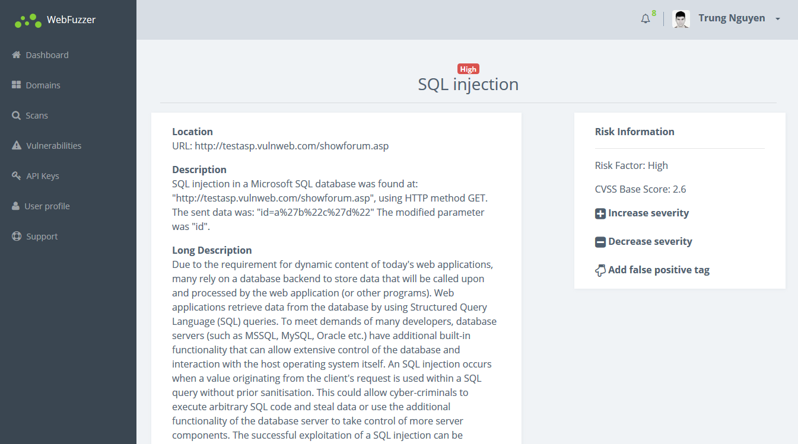

# Cystack team
# About WebFuzzer
## What is WebFuzzer?
**WebFuzzer** is a SAAS (Software As A Service) **Web Application Penetration** product in which it has:
- Input: Web application domain
- Output: Overall graph report, list of vulnerabilities and their details.

The spectacular superority of **WebFuzzer** is that it provides patching strategies after finding vulnerabilities in Web application by 2 selections:
- Automatically generating rules for **modsecurity** and **iptables** for customers to update on their system
- Guiding customers to use Web Application Firewall and then apply patches to revamp their Web application system

## WebFuzzer advantages
- **Easy to use:**
	- Friendly Web application user interface
	- No need to install any addtional modules or plugins except a browser
	- No need to care about *client computer* specs
- **Opensource**, build on the top of [w3af](https://github.com/andresriancho/w3af), with a highly extensible ability
- Having the ability to detect more than **200 types of vulnerabilities** (and this number will absolutely increase in the future)
- **Distributed handling**, be able to simultaneously handle a considerable amount of Web application
- **REST API**: Allow security specialists build their Scanner base on the **WebFuzzer** architecture.
- **Multiplatform**: Currently **WebFuzzer** works as a *Web service*. *CLI*, *Mobile*, *PC* and other platforms will be supported in the near future base on the built APIs.

## System architecture

## Deploy guide (for service providers, not endpoint users)
1. Instasll [w3af](https://github.com/andresriancho/w3af) on dedicated servers and start the *w3af_api* process. 
	Cài w3af trên các server riêng biệt và khởi động tiến trình w3af_api. Trên mỗi server có thể mở nhiều tiến trình này tùy thuộc vào cấu hình
2. Cài đặt RabbitMQ làm hàng đợi thông điệp
3. Cấu hình Server và Dispatcher làm Producer và Consumer cho hàng đợi trên, đồng thời cấu hình đến danh sách server w3af theo ip và port
4. Thiết lập môi trường cho Server Flask bằng nginx, gunicorn
5. Khởi động server

## Giao diện

